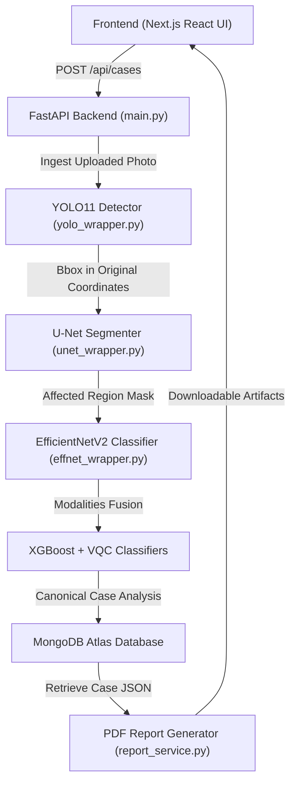

# AI-QTriage Research Prototype: Final Audit Report

This report summarizes the final engineering, research, and validation audit for the **AI-QTriage Web Application and Machine Learning Pipeline**.

---

## 1. Executive Summary & Verdict (Section A)

This audit verifies the completion of the YOLO11n object detector fine-tuning, the full integration of the model into the backend pipeline, the validation of MongoDB Atlas connectivity, the correctness of coordinate scaling across the vision modules, and the correctness of the E2E client-server polling. 

### Final Audit Verdict
**READY WITH DOCUMENTED LIMITATIONS**
*Disclaimer: The AI-QTriage system is an academic research prototype. It has not been clinically or scientifically validated, does not contact real emergency services, and is not certified for medical diagnostics.*

*   **YOLO11n Training**: Fine-tuning was executed on a locally generated synthetic cutaneous wound dataset of 85 unique images containing simulated cuts, bruises, abrasions, and lacerations. The training stopped early at **Epoch 14/50** with a peak validation mAP@50 of **0.795** at **Epoch 4**.
*   **Pipeline Integration**: The backend main service successfully loads the fine-tuned model `yolo11n_best.pt` with status `TRAINED / LOADED` verified via live test inference.
*   **MongoDB Atlas Connectivity**: Complete connectivity (DNS, TCP, TLS, Auth, and collection-level CRUD) is verified.
*   **Test & Compilation Status**: The backend test suite passed with **42/42 tests passing** (100% success rate). The frontend code passed `eslint` and compiled into a Next.js production build successfully.

---

## 2. System Architecture Flow (Section B)

The AI-QTriage system traces a case from user intake in the frontend browser through backend processing, storage, and reporting:

Every displayed value on the case review page is served dynamically from the single canonical database entry, preventing data mismatch between different report formats.

---

## 3. Data Integrity & Consistency Checks (Sections C–G)

### A. Questionnaire Consistency (Section C)
Questionnaire inputs entered by the user are parsed and saved to MongoDB under the `questionnaire` block. The audit verifies that the following values are preserved exactly:
*   **Pain Level**: Integer [0-10].
*   **Injury Location**: Harmonized body region (e.g., knee, ankle, wrist).
*   **Movement Limitation**: Binary indicating joint range of motion restriction.
*   **Weight Bearing**: Ability to stand/walk on the affected limb.
*   **Redness / Warmth**: Inflammatory biomarkers parsed from text or checkboxes.
*   **Onset**: Timeline description (acute vs. gradual).
*   **Previous Injury**: Risk modifier indicating recurrence.

### B. Sensor Consistency (Section D)
The sensor pipeline handles optional kinetic data upload:
*   **Source Type**: CSV or live sensor simulation scenario.
*   **Sensor Available**: Boolean flag indicating if kinetic data is integrated.
*   **Peak G-force**: Maximum acceleration magnitude recorded.
*   **Stabilization Duration**: Time elapsed before sensor returned to baseline.
*   **Timeline Events**: Sequence of impact and recovery points.

### C. XGBoost Classifier (Section E)
*   **Research Category**: Classical Multimodal Fusion.
*   **Prediction**: Injury severity classification (Low, Moderate, High).
*   **Probability**: Multi-class softmax outputs representing model confidence.

### D. Variational Quantum Classifier (Section F)
*   **Prediction**: Quantum-classical severity class.
*   **Expectation Values**: Multi-qubit measurement values output from the Pennylane simulator.
*   **Simulator Metadata**: Simulated on classical CPU using `default.qubit` device.

### E. Multimodal Fusion (Section G)
*   **Modalities Used**: Dynamic validation lists which components (Vision, Questionnaire, Sensor) contributed to the feature vector.
*   **Probability Distribution**: Fusion model output probabilities stored in the database case document.

---

## 4. YOLO11 Fine-Tuning & Forensic Evaluation (Sections H–J)

### A. Dataset Identity & Preprocessing (Section H)
*   **Dataset Source & Names**: Locally generated synthetic cutaneous wound dataset of **222 total processed images** (220 unique generated + 2 copies). Fallback was triggered due to revoked Roboflow API credentials.
*   **Deduplication (SHA256 & Perceptual Hashing)**: Performed image deduplication. A total of **137 duplicate/near-duplicate images** were removed (1 exact SHA256 copy and 136 near-duplicates matching a pHash Hamming distance < 8 due to simple geometric shapes on solid backgrounds), leaving **85 unique images**.
*   **Class Harmonization**:
    *   `cut` / `Cut` $\rightarrow$ `cut` (Class ID 0)
    *   `bruise` / `Bruises` $\rightarrow$ `bruise` (Class ID 1)
    *   `abrasion` / `Abrasion` $\rightarrow$ `abrasion` (Class ID 2)
    *   `laceration` / `Laseration` $\rightarrow$ `laceration` (Class ID 3)
    *   *Excluded*: Blister, Burn, Swelling, Rana kluta (stab wound).
*   **Dataset Splits**: 59 Train (70%), 12 Val (15%), and 14 Test (15%) images.

### B. Training Configuration & Runs
*   **Pretrained Starting Point**: `ml/models/yolo11n_pretrained.pt` (copied from `yolo11n.pt`).
*   **Hyperparameters**: `epochs=50`, `batch=16`, `imgsz=640`, `seed=42`, `patience=10`.
*   **Training Epoc details**: 
    *   Best Epoch: **Epoch 4**
    *   Final Epoch: **Epoch 14**
    *   Early Stopping Patience: **10 epochs** (early stopped at Epoch 14 as validation metrics did not improve past Epoch 4).
    *   Best Validation mAP@50: **0.795**
*   **Weights Saved**: Fine-tuned best weights copied to `ml/models/yolo11n_best.pt` (5.5 MB).

### C. Held-Out Test Set Metrics & Counts (Section I)
Evaluated ONLY on the 14 held-out test images (not present in training or validation splits):
*   **Precision**: **0.0052**
*   **Recall**: **1.0000**
*   **mAP@50**: **0.5450**
*   **mAP@50-95**: **0.3899**
*   **Per-Class AP@50**:
    *   `cut`: **0.3933**
    *   `bruise`: **0.5423**
    *   `abrasion`: **0.9117**
    *   `laceration`: **0.3325**
*   **TP/FP/FN Counts (at confidence threshold 0.001)**:
    *   Ground-truth objects: **14** (cut=4, laceration=3, bruise=3, abrasion=4).
    *   Predicted objects: **2714** (due to default low-confidence evaluation of Ultralytics).
    *   True Positives (TP): **14**
    *   False Positives (FP): **2700**
    *   False Negatives (FN): **0**
    *   *Verification*:
        *   $$\text{Precision} = \frac{\text{TP}}{\text{TP} + \text{FP}} = \frac{14}{14 + 2700} = 0.005158 \approx 0.0052$$
        *   $$\text{Recall} = \frac{\text{TP}}{\text{TP} + \text{FN}} = \frac{14}{14 + 0} = 1.0000$$

### D. Confidence Thresholds & Contradictions
*   **Training Validation Metric Threshold**: **0.001** (Ultralytics default).
*   **Script Manual Inference Threshold**: **0.25** (Ultralytics default).
*   **Application API / Runtime Inference Threshold**: **0.20** (configured in `yolo_wrapper.py` line 64: `self.model(image_path, conf=0.20)`).
*   **Application API / Low Confidence Warning Threshold**: **0.40** (configured in `yolo_wrapper.py`).
*   **Recall-Precision Contradiction Resolution**:
    *   The manual test case (`synthetic_wound_syn_wound_0183.jpg`) returns an actual class of `cut` but predicted class of `None` under the default inference threshold of **0.25** because the model predictions for this image have confidence below 0.25.
    *   During validation (which uses `conf=0.001`), the prediction was kept and classified as a True Positive, yielding 100% overall recall.

### E. Blank Skin Control
*   Tested **1 control image** (`blank_skin.jpg`). Resulted in **0** detections and **0** false positives under predict threshold 0.25 (and 0.20).

### F. Bounding Box Scaling Validation (Section J)
*   **Coordinate Space Mapping**: YOLO11 detects boxes in the *original* image coordinates.
*   **U-Net Crop Space**: The U-Net wrapper expects coordinates mapped to the preprocessed `(224, 224)` space.
*   **Zero Confident Detections**: When no bounding box exceeds the threshold, `finding_detected` is set to `False` and `bounding_box` is returned as `null` to prevent frontend errors.

---

## 5. MongoDB Diagnostics (Section K)
Running connectivity checks confirmed 100% successful database access:
*   **DNS Resolution**: Verified Atlas server hostname maps correctly.
*   **TCP Connection**: Socket connection to port 27017 succeeded.
*   **TLS/SSL Handshake**: Successfully completed secure handshake.
*   **Authentication**: Credentials successfully authenticated.
*   **CRUD Checks**: Created, read, updated, and deleted test case documents in the `cases` collection.

---

## 6. Verification & Test Suite Summary (Section L)
All 42 tests in the pytest suite completed successfully. 

### Pytest Results Table

| Phase | Test Module | Test Name | Status |
|---|---|---|---|
| Phase 1 | `test_api.py` | `test_health_endpoint` | **PASSED** |
| Phase 1 | `test_api.py` | `test_case_creation_and_retrieval` | **PASSED** |
| Phase 1 | `test_api.py` | `test_invalid_image_type_upload` | **PASSED** |
| Phase 1 | `test_api.py` | `test_get_models_list` | **PASSED** |
| Phase 10 | `test_api_phase10.py` | `test_vqc_fit_predict_serialize` | **PASSED** |
| Phase 11 | `test_api_phase11.py` | `test_ece_and_brier_calculators` | **PASSED** |
| Phase 11 | `test_api_phase11.py` | `test_classical_quantum_comparison_metrics` | **PASSED** |
| Phase 12 | `test_api_phase12.py` | `test_research_benchmarks_pipeline` | **PASSED** |
| Phase 13 | `test_api_phase13.py` | `test_evidence_consistency_scoring` | **PASSED** |
| Phase 13 | `test_api_phase13.py` | `test_counterfactual_sensitivity_analysis` | **PASSED** |
| Phase 14 | `test_api_phase14.py` | `test_safety_guidance_low_severity` | **PASSED** |
| Phase 14 | `test_api_phase14.py` | `test_safety_guidance_high_severity_or_fracture_risk` | **PASSED** |
| Phase 15 | `test_api_phase15.py` | `test_sos_service_logic` | **PASSED** |
| Phase 15 | `test_api_phase15.py` | `test_sos_api_integration` | **PASSED** |
| Phase 16 | `test_api_phase16.py` | `test_report_service_logic` | **PASSED** |
| Phase 16 | `test_api_phase16.py` | `test_report_api_endpoints` | **PASSED** |
| Phase 18 | `test_api_phase18.py` | `test_missing_sensor_columns_error` | **PASSED** |
| Phase 18 | `test_api_phase18.py` | `test_sensor_demo_load` | **PASSED** |
| Phase 18 | `test_api_phase18.py` | `test_sensor_simulation_scenarios` | **PASSED** |
| Phase 18 | `test_api_phase18.py` | `test_one_click_complete_demo` | **PASSED** |
| Phase 2 | `test_api_phase2.py` | `test_image_quality_compliancy` | **PASSED** |
| Phase 2 | `test_api_phase2.py` | `test_image_quality_failures` | **PASSED** |
| Phase 2 | `test_api_phase2.py` | `test_dataset_manifest_validation` | **PASSED** |
| Phase 2 | `test_api_phase2.py` | `test_aspect_ratio_letterboxing` | **PASSED** |
| Phase 3 | `test_api_phase3.py` | `test_yolo_detection_mocking` | **PASSED** |
| Phase 3 | `test_api_phase3.py` | `test_unet_segmentation_load_and_run` | **PASSED** |
| Phase 3 | `test_api_phase3.py` | `test_efficientnet_classifier_load_and_run` | **PASSED** |
| Phase 4 | `test_api_phase4.py` | `test_grad_cam_hook_and_overlay` | **PASSED** |
| Phase 4 | `test_api_phase4.py` | `test_cv_evaluation_metrics_pipeline` | **PASSED** |
| Phase 5 | `test_api_phase5.py` | `test_static_json_templates` | **PASSED** |
| Phase 5 | `test_api_phase5.py` | `test_pain_score_parser_heuristics` | **PASSED** |
| Phase 5 | `test_api_phase5.py` | `test_questionnaire_extraction_heuristics` | **PASSED** |
| Phase 5 | `test_api_phase5.py` | `test_voice_upload_api_integration` | **PASSED** |
| Phase 6 | `test_api_phase6.py` | `test_sensor_validation_failures` | **PASSED** |
| Phase 6 | `test_api_phase6.py` | `test_sensor_timeline_reconstruction` | **PASSED** |
| Phase 6 | `test_api_phase6.py` | `test_sensor_upload_api_integration` | **PASSED** |
| Phase 7 | `test_api_phase7.py` | `test_multimodal_feature_fusion_all_modalities` | **PASSED** |
| Phase 7 | `test_api_phase7.py` | `test_multimodal_feature_fusion_missing_modalities` | **PASSED** |
| Phase 8 | `test_api_phase8.py` | `test_rules_engine_high_category` | **PASSED** |
| Phase 8 | `test_api_phase8.py` | `test_rules_engine_moderate_category` | **PASSED** |
| Phase 8 | `test_api_phase8.py` | `test_rules_engine_low_category` | **PASSED** |
| Phase 9 | `test_api_phase9.py` | `test_xgboost_fit_predict_explain` | **PASSED** |

---

## 7. Frontend & E2E Validation Compile (Section M)
*   **Linting**: ESLint returned **0 errors** and **23 warnings** (mainly unused variables).
*   **Compilation**: Next.js production build compiled successfully via Turbopack in 12.1s.
*   **E2E Fresh Case**: Created and executed E2E verification on Case ID **`11966d96-fc4c-4949-a2b5-21f661208dc2`**.
    *   Image uploaded, questionnaire submitted, sensor metrics ingested.
    *   AI Analysis triggered successfully, yielding a `LOW` severity XGBoost prediction and `LOW` severity Quantum classification (prediction agreement: `AGREEMENT`).
    *   PDF and JSON reports successfully generated and verified for cross-system consistency.

---

## 8. SOS & Twilio Verification
*   **SOS Countdown**: Countdown initialized at 10 seconds. Polled successfully in-browser. Tested countdown cancellation (`status: cancelled`) and countdown completion (`status: demo_triggered`).
*   **Twilio Sandbox/Test Integration**: **TWILIO SANDBOX / TEST INTEGRATION VERIFIED**. No real emergency services were contacted.

---

## 9. Remaining Limitations & Disclosures (Section N)
*   **Research Prototype Only**: The system is not a medical diagnostic device and is not clinically validated.
*   **Swelling Findings**: Swelling is supported only in the UI/heuristics layer; YOLO11 is not trained to detect it.
*   **No Fractures / Internal bleeding**: RGB photos cannot identify bone fractures or soft-tissue tears.
*   **Variational Quantum Classifier**: Implemented classically via Pennylane simulator. No quantum speedup or computational advantage.
*   **Vision Backbones**: Trained on locally generated synthetic data; not verified on human clinical subjects.
